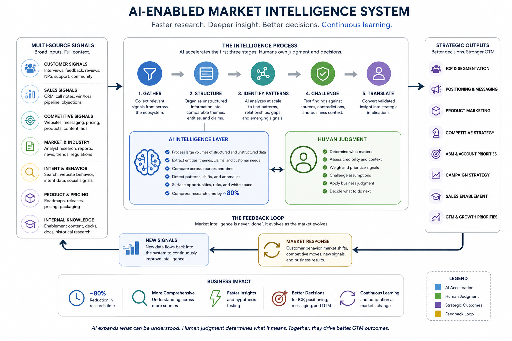

# ai-market-intelligence
An AI-enabled approach to accelerating customer, market, and competitive intelligence for better GTM decisions.

# AI Market Intelligence

### Accelerating customer, market, and competitive intelligence for better GTM decisions

Marketing teams have access to more customer, market, and competitive information than ever before. The challenge is rarely finding information. It's bringing fragmented signals together quickly enough — and with enough context — to make better decisions.

I developed an AI-enabled approach to customer, market, and competitive intelligence that reduced research time by approximately **80%** while expanding the range of information that could be considered in strategic decision-making.

The objective wasn't simply to research faster.

It was to improve how marketing **understands the market before it acts**.

## The Problem

Traditional market intelligence is often fragmented across:

* Customer interviews and feedback
* Win/loss information
* CRM and sales data
* Competitive websites and messaging
* Analyst and industry research
* Search and market trends
* Reviews and community conversations
* Intent and behavioral signals
* Product and pricing information
* Internal knowledge held by sales, product, and customer teams

Each source provides part of the picture.

The harder problem is connecting those signals to understand what they collectively mean for the business.

Manual research also creates a practical constraint: when gathering and synthesizing information takes days or weeks, teams inevitably narrow the questions they ask and the sources they examine.

AI changes that constraint.

## The Approach

I use AI as an intelligence and synthesis layer across multiple sources rather than as a replacement for primary research or human judgment.

The approach follows a simple progression:

**Signals → Synthesis → Insight → Strategic Decision → Market Feedback**

AI can accelerate the first three stages dramatically.

Human judgment becomes increasingly important as the process moves toward decisions.

### 1. Gather Signals

Bring together relevant information from customer, market, competitive, sales, product, and external sources.

The objective is breadth without losing context.

### 2. Structure the Information

Use AI to organize large amounts of unstructured information into comparable themes, patterns, entities, claims, customer needs, competitive positions, and market signals.

This turns fragmented information into something that can be interrogated systematically.

### 3. Identify Patterns

Look across sources for:

* Repeated customer problems
* Emerging needs
* Buying triggers
* Objections and barriers
* Competitive strengths and weaknesses
* Messaging patterns
* Market gaps
* Changes in customer language
* High-value segments
* Signals of changing demand

AI makes it possible to explore substantially more relationships and hypotheses than a conventional manual research process.

### 4. Challenge the Findings

AI-generated synthesis should not automatically become strategy.

Important findings are tested against source material, contradictory evidence, internal knowledge, customer behavior, and business context.

The goal isn't AI-generated certainty.

It's **better-informed human judgment**.

### 5. Translate Intelligence Into Decisions

The intelligence becomes valuable when it changes what the business does.

Insights can inform:

* ICP definition and refinement
* Market segmentation
* Positioning
* Messaging
* Product marketing
* Competitive strategy
* Account prioritization
* ABM
* Sales enablement
* Campaign strategy
* Geographic expansion
* Product and GTM priorities

The output is not a research report.

The output is a **better decision**.

## Where AI Changes the Model

The most obvious improvement is speed.

In practical use, this approach reduced research time by approximately **80%**.

But speed creates a second-order advantage that is potentially more important.

When research becomes dramatically less expensive in time and effort, teams can:

* Examine more sources
* Ask more questions
* Test more hypotheses
* Revisit assumptions more frequently
* Explore segments that previously wouldn't justify a lengthy research cycle
* Update intelligence as markets change rather than relying on periodic research projects

Market intelligence can move from an occasional project to an **ongoing capability**.

## Human Judgment Is Part of the System

AI is particularly strong at processing volume, structuring information, identifying patterns, comparing large bodies of information, and accelerating analysis.

But those capabilities don't eliminate the need for judgment.

Someone still needs to determine:

* Which questions matter
* Which sources are credible
* Which signals deserve weight
* Whether correlation actually means something
* What contradicts the emerging narrative
* Which insights matter to the business
* What action should follow

That division of labor is intentional.

**AI expands what can be understood. Human judgment determines what it means.**

## The Feedback Loop

Market intelligence shouldn't end when a strategy is approved.

Once a decision is made, market response creates new information:

**Market signals → AI-enabled synthesis → Strategic insight → Business decision → Market response → New signals**

That feedback creates a continuously improving understanding of the market.

The objective isn't perfect knowledge.

It's reducing the distance between **what the company believes about its market and what is actually happening in it**.

## Business Impact

Applied effectively, this approach can improve both efficiency and strategic quality:

* **~80% reduction in research time**
* Faster customer and competitive analysis
* More comprehensive market understanding
* Faster testing of strategic hypotheses
* Stronger ICP and segmentation decisions
* Better-informed positioning and messaging
* More responsive GTM planning
* Greater ability to revisit assumptions as conditions change

The value of AI isn't simply doing the old research process faster.

It's changing **how much the organization can understand before making a decision**.

## Design Principle

This work follows the same principle behind my broader approach to AI:

**Start with the business problem, not the technology.**

The question isn't whether AI can conduct market research.

The more useful question is:

**Where and how can AI improve our understanding enough to make a better decision?**

## What's Next

Areas I'm continuing to explore include:

* Persistent customer and market intelligence systems
* Automated detection of meaningful market changes
* Competitive positioning and messaging monitoring
* AI-assisted win/loss analysis
* Dynamic ICP and segmentation models
* Integration of qualitative and quantitative signals
* Connecting market intelligence more directly to GTM planning
* Building feedback loops that continuously test assumptions against market response

---

*This repository documents the methodology and strategic approach. Examples are intentionally generalized to protect proprietary company, customer, and competitive information.*
